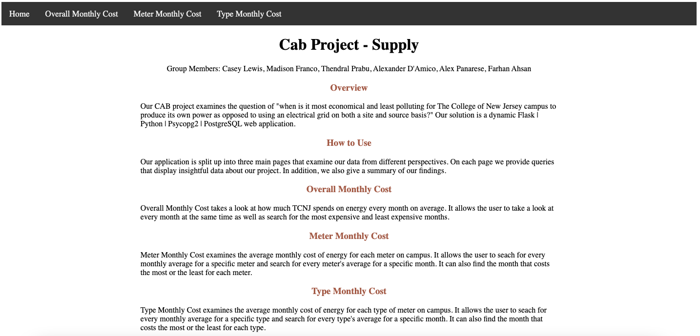
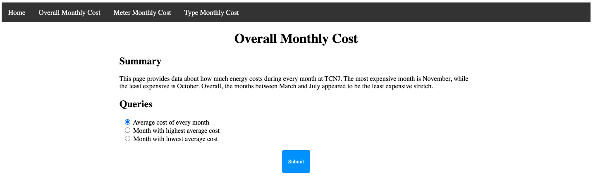
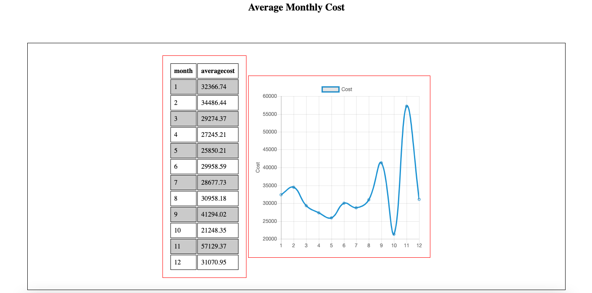
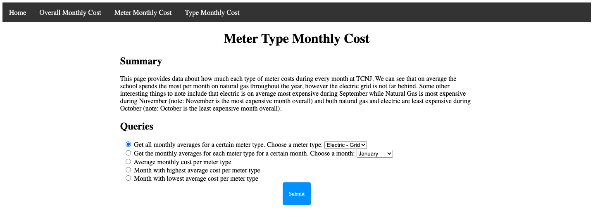
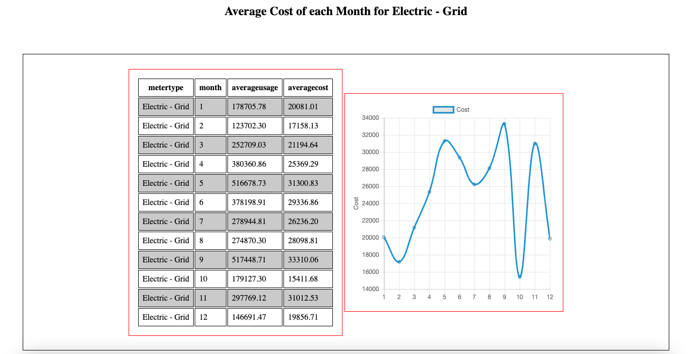
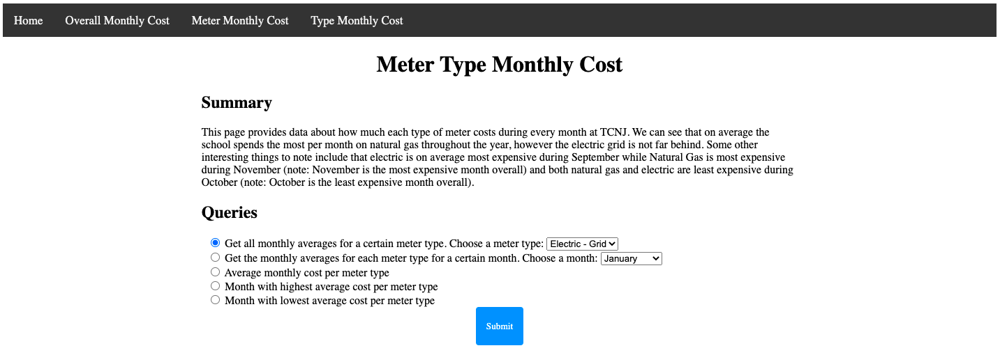
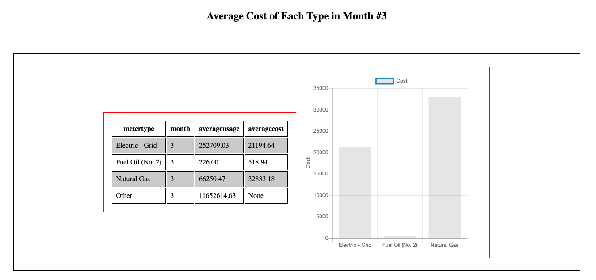

# CAB Project

Group Members: Casey Lewis, Madison Franco, Thendral Prabu, Alexander D'Amico, Alex Panarese, Farhan Ahsan

## Table of Contents:

1. [Overview](#Overview)
2. [Features](#features)
3. [How it works](#instructions)
4. [How to install](#install)
5. [How to run](#run)
6. [Wiki](#wiki)

## Overview 

Our CAB project examines the question of "when is it most economical and least polluting for The College of New Jersey campus to produce its own power as opposed to using an electrical grid on both a site and source basis?" Our solution is a dynamic web application created using the flask framework on python and will be supported by a PostgeSQL database. 

## Features 

Our application is split up into three main pages that examine our data from different perspectives. On each page we provide queries that display insightful data about our project. Each query returns data in the format of a table, however, some queries also return graphs where relevant. In addition, we also give a summary of our findings on each page.

### Home Page

### Overall Cost Page

### Meter Cost Page

### Type Cost Page

## How it works 

First, go to the page containing the relevant data that you would like to examine. Next, you can read through our summary to see some key takeaways that we had from the results of our queries. Next, pick the query that you would like to run by using the radio buttons. Where applicable, also make a choice from the dropdown menu to specify a variable in the query. Lastly, click submit and view the data that displays below. For all queries, a table will appear, however certain queries will also display a graph in addition to the table.

## How to install 

First, ensure that Postgres is installed on your machine.

Next, use the following commands in terminal window within this folder to install and configure database:

- createdb cabproject
- psql -d cabproject -a -f (insert path to sql/ddl.sql file)
- psql -d cabproject -a -f (insert path to sql/populaton.sql file)
* This population file is NOT available in our public release for privacy reasons *

NOTE: The following dependencies may need to be installed before the app can be run:

- sudo pacman -Syu
- sudo pacman -S python-pip python-psycopg2
- pip install flask

## How to run 

First, open up main-app/database.ini and adjust the credentials to match your local Postgres account.

Next, use the following commands in terminal window within the app folder to run the web application:

- export FLASK_APP=app.py
- flask run
- browse to http://127.0.0.1:5000/

## Wiki 

Please check out our [Wiki](https://github.com/TCNJ-degoodj/cab-project-1-1/wiki) for all important project documents.
